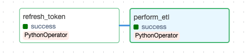
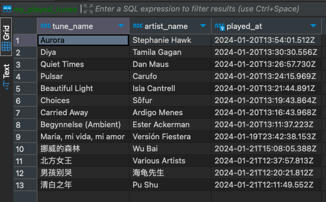

# SpotifyTunesTracker

SpotifyTunesTracker is a data engineering project designed to track your daily music listening habits on Spotify.

## Idea

This project is inspired by [this free data engineering course for beginners](https://github.com/karolina-sowinska/free-data-engineering-course-for-beginners), but it includes several enhancements:

- **OAuth Authorization Flow**: Instead of copying the explicit `access_token` from the Spotify API dashboard, this project requests token information using OAuth authorization flow, adapting to Spotify's updated API policies.
- **Automatic Token Refresh**: Access tokens are refreshed automatically when they expire, eliminating the need for manual updates.
- **Cloud Deployment (In Progress)**: The project will be deployed on cloud services, including AWS EC2 and RDS, for more robust and scalable operations.

## Progress

As of Jan 22, 2024, the project has successfully implemented a request mechanism to obtain token information using client credentials, developed an ETL pipeline for loading the past 24 hours' tunes into a local database, and automated the refresh of access tokens using the refresh_token upon expiry of the access_token.




## Usage

Currently, there are two ways to run the project:

1. **Try with Flask Service**:

   ```bash
   python3 authorization.py
   ```

2. **Automate with Airflow** (retrieve recently played tunes every day):

   ```bash
   source ./dags/start_dag.sh
   ```

   Note: The initial access token still needs to be obtained manually through `authorization.py` and hard-coded into 'start_dag.sh' due to the requirement of Spotify's user login.
